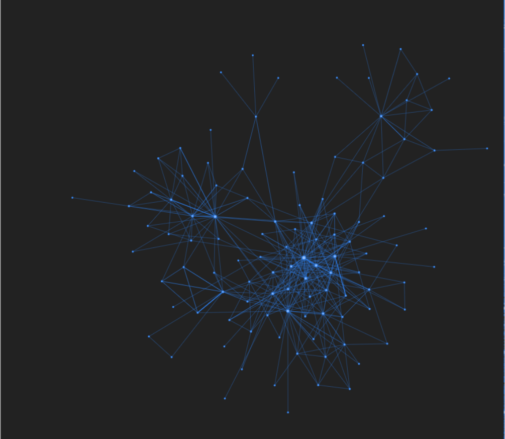
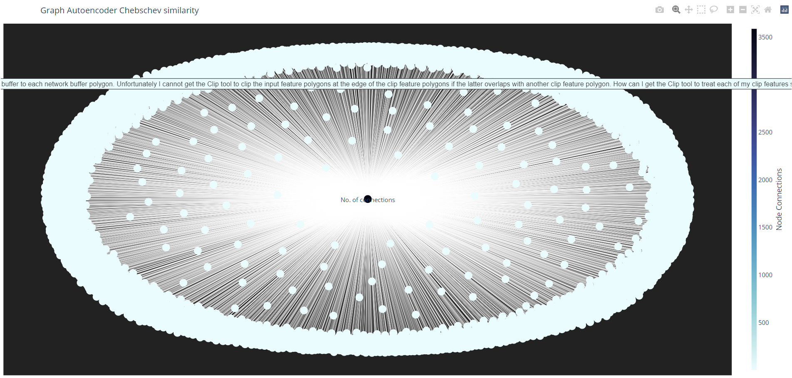
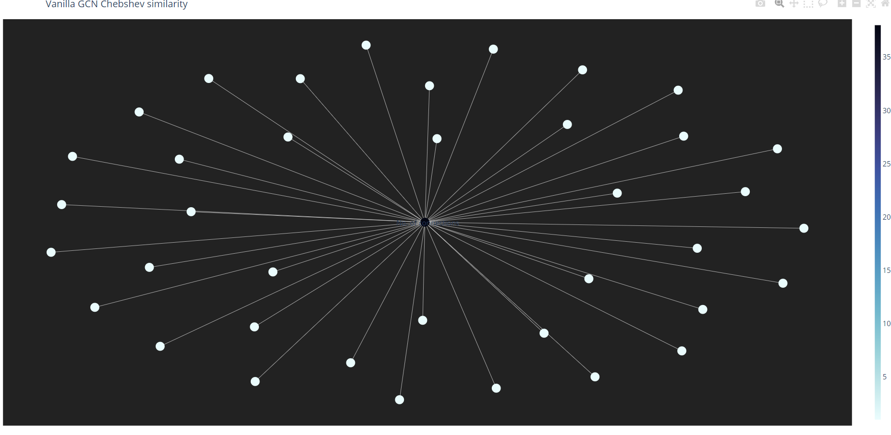
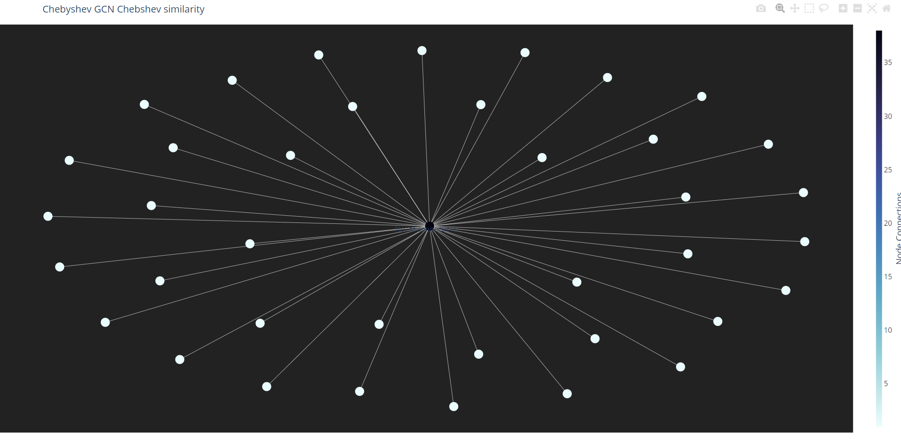

# SpectralEmbeddings


## A Spectral Embedding library made of Graph Convolution Networks and AutoEncoders :robot:




This is a embedding generator library used for creating Graph Convolution Network, and Graph Autoencoder embeddings from Knowledge Graphs. This allows projection of higher order network dependencies for creating the node embeddings with respect to a neighborhood. There are 2 different approaches: 

- Graph AutoEncoder Approach: This models the first and higher order similarity measures in a graph for each node in a neighborhood. The first and second order similarity measures are created through an Autoencoder circuit which preserves the proximity loss of similarity with reconstruction loss.


 
 


- Graph Convolution Network Variants: These include VanillaGCN,ChebGCN and SplineGCN kernels which provide spectral embeddings from a knowledge graph.


 - VanillaGCN: The steps to produce this include ,creating the adjacency matrix representation along with the node features from the inputs. The labels have to be one hot encoded to maintain the dimensions of the inputs. The model inputs are in the form of [node features,adjacency matrix] representation and the outputs are [one hot encoded node labels]. This matrix is then processed and additional layers such as Embedding Layer/LSTM can be added to perform node classification. We extract the penultimate layer for getting the embeddings in this case.

   

   

  - SplineGCN: Spline GCN involve computing smooth spectral filters to get localized spatial filters. The connection between smoothness in frequency domain and localization in space is based on Parseval’s Identity (also Heisenberg uncertainty principle): smaller derivative of spectral filter (smoother function) ~ smaller variance of spatial filter (localization) In this case, we wrap the vanilla GCN with an additional spline functionality by decomposing the laplacian to its diagonals (1-spline) . This represents the eigenvectors which can be added independently instead of taking the entire laplacian at one time. The rest of the code segment remains the same.

  
  
  


  - ChebGCN: This is one of the most important part of spectral GCN where Chebyshev polynomials are used instead of the laplacian. ChebNets are GCNs that can be used for any arbitrary graph domain, but the limitation is that they are isotropic. Standard ConvNets produce anisotropic filters because Euclidean grids have direction, while Spectral GCNs compute isotropic filters since graphs have no notion of direction (up, down, left, right).

  

  


## Dependencies

<a href="https://www.tensorflow.org/">Tensorflow</a>


<a href="https://networkx.org/">Networkx</a>


<a href="https://scipy.org/">scipy</a>


<a href="https://scikit-learn.org/stable/">sklearn</a>


## Usability

Installation is carried out using the pip command as follows:

```python
pip install SpectralEmbeddings==0.1
```

This library is built with Tensorflow:


[Spectral Embeddings](https://github.com/abhilash1910/SpectralEmbeddings) is a [python package](https://pypi.org/project/SpectralEmbeddings/0.2) which is used to generate embeddings from knowledge graphs with the help of deep graph convolution kernels and autoencoder networks. This library is used to generate 2 different kinds embeddings:

- Graph AutoEncoder Embeddings:  This models the first and higher order similarity measures in a graph for each node in a neighborhood. The first and second order similarity measures are created through an Autoencoder circuit which preserves the proximity loss of similarity with reconstruction loss. This model has been implemented along the lines of [SDNE](https://paperswithcode.com/method/sdne) . These embeddings not only cover the first order dependencies but also are used to capture second order dependencies between node neighbors. The output of this AutoEncoder network has a dimension of (number of input entries,dimension of embedding space provided). The Graph Autoencoder also produces full embedding subspace over all the entries with the provided hidden dimensions and can be found in the example provided here.A preview of the generated embeddings are shown here:


  The architecture for the Graph AutoEncoder is represented with the help of unsupervised local structure component (first order) and a supervised global structure component (second order) which are linked for each node in the graph.


  For using the library for the Graph AutoEncoder embeddings, we have the following steps:
  - Install the library with pip
    ```python
    pip install SpectralEmbeddings==0.2
    ```
  - Create a function to read the input csv file. The input should contain atleast 2 columns - source and target(labels). And both should be in text format. These can include textual extracts and their corresponding labels. The graph is then created as a MultiDigraph from [networkx] with the target and source columns from the input csv file. While generating the embeddings, the extracts from the labels are also considered and can be used to determine which label is the closest to the provided source(input text). In the example below, the 'test_graph_ae' method shows this. The dataset chosen for this demonstration is [Google Quest QnA](https://www.kaggle.com/c/google-quest-challenge) and as such any dataset having a source and a label column(textual contents) can be used to generate the embeddings. The main function for creating the Graph AutoEncoder embedding is the 'get_sdne_embeddings' method. This method takes as parameters: hidden_dims (denotes the hidden embedding dimension of the neural network), alpha and beta are empirical constants for finetuning the embeddings, epochs (number of training iterations), the dataframe along with the source and target labels. The model outputs a embedding matrix (no of entries, no of hidden dims) and the corresponding graph. The graph can then be used for plotting the Chebyshev similarity between each node with the rest of the community neighborhood. The following preview shows the code for generating the Graph AutoEncoder Embeddings
 ```python
   def test_graph_ae():
      source_label='question_body'
      target_label='category'
      print("Input parameters are hidden dimensions ,alpha,beta,epochs")   
      hidden_dims=[32,16]
      alpha=1e-4
      beta=1e-5
      epochs=20
      g_emb,graph_ae_pl=graph_ae.get_sdne_embeddings(train_df,source_label,target_label,hidden_dims,alpha,beta,epochs)
      print(g_emb)
      return g_emb,graph_ae_pl
  ```
  For plotting(with plotly ) the node embedding of a particular node (represented through a number), the 'plot_ae_embed' method can be used, which takes as parameters the subgraph containing the input node with the rest of the nodes, the input node number and the embedding matrix (embedding weights). This is represented below as :
  ```python
  def plot_ae_embed(graph,node_num,emb,label):
    
      node,distances,questions=graph_ae.node_level_embedding(graph,node_num,emb)
      vg_df=pd.DataFrame()
      vg_df['Premise']=[node]*len(distances)
      vg_df['Hypothesis']=questions
      vg_df['Chebyshev_Distance']=distances
      vg_g=nx.from_pandas_edgelist(vg_df,source='Hypothesis',target='Premise',edge_attr='Chebyshev_Distance')
      plotter(vg_g,label)
      return vg_g
   ```
  Alternately the 'pyvis_plotter' method can also be used which uses the [pyvis library](https://pyvis.readthedocs.io/). Thus the only requirement for creating autoencoder based node representations is a dataframe containing source and target columns both of which should be in textual format.


- Graph Convolution Kernel Embeddings: These embeddings are based on spectral graph convolution kernels which capture node representations through laplacian norm matrices. This part is based on the [Graph Convolution Network paper](http://arxiv.org/abs/1609.02907). The GCNs are based on deep neural networks which operate on the node features and the normalized laplacian of the adjacency matrix of input graph. The GCNs are mainly used for node/subgraph classification tasks but here we are interested in capturing only the embeddings from the penultimate layer of the network. For this we create an Embedding based on Tensorflow as node features. We define that the nodes that don’t have predecessors are in layer 0. The embeddings of these nodes are just their features. To calculate the embeddings of layer k we weight the average embeddings of layer k-1 and put it into an activation function. In this kernel there are 3 variations : Vanilla GCN, Chebyshev GCN and Spline GCN embeddings

  
  - VanillaGCN kernel: A Vanilla GCN/GNN utilizes the graph laplacian (not normalized laplacian) along with a spectral filter and recursively augments the weights of the next layer based on the previous layer. Here the spectral filter weights are initialized using keras/tf. The rest of the part involves multiplying the Laplacian tuple [node_features,adjacency matrix] with the spectral filter (kernel) and applying an activation over the result. Generally a softmax activation is applied for classifying the outputs according to the labels.Since we are not classifying the nodes, we can extract the final node weights from the penultimate layer . This allows the projection of the embedding subspace in the VGCN kernel. 
  The steps for using this(or any other variant of GCN kernel) is as follows:
    - Install the library with pip
    ```python
    pip install SpectralEmbeddings==0.2
    ```
    - Create a function which is similar to 'test_vanillagcn' method. The important submethod is taken from the SpectralEmbeddings.VanillaGCN python script. The 'get_gcn_embeddings' method is of importance which is used to create the final embeddings after passing it through the kernel. The input parameters are the hidden units(number of hidden neurons for the intermediate GCN layers), number of layers (signifies the number of hidden layers), subset(this includes what part of the entire dataframe should be considered, for instance out of 2000 entries we would like to get the node embeddings of 25 such entries, so subset becomes 25), epochs, the dataframe (input) and the source,target labels (strings). The method returns the embedding matrix and the graph. The embedding matrix has a dimension of (size of subset entries, number of labels). For instance if the subset size is 20 and the set of labels is 6, then the final embedding dimension will be (20,6). Also since GCN uses a classification kernel the embeddings are projected on the basis of the number of unique labels in the input.(All graph kernels follow this rule for projection).
  ```python
    def test_vanillagcn():
      print("Testing for VanillaGCN embeddings having a source and target label")
      #train_df=pd.read_csv("E:\\train_graph\\train.csv")
      source_label='question_body'
      target_label='category'
      print("Input parameters are hidden units , number of layers,subset (values of entries to be considered for embeddings),epochs ")
      hidden_units=32
      num_layers=4
      subset=34
      epochs=10
      v_emb,v_graph=vgcn.get_gcn_embeddings(hidden_units,train_df,source_label,target_label,epochs,num_layers,subset)
      print(v_emb.shape)
      return v_emb,v_graph
   ```
   A preview of the generated embeddings from the dataset of 34 node entries is represented as :
   For plotting the embeddings of a node(similar to Graph AutoEncoder embeddings), we can use the 'plot_vgcn_embed' method as follows.
   ```python
    def plot_vgcn_embed(graph,node_num,emb,label):
      node,distances,questions=vgcn.node_level_embedding(graph,node_num,emb)
      vg_df=pd.DataFrame()
      vg_df['Premise']=[node]*len(distances)
      vg_df['Hypothesis']=questions
      vg_df['Chebyshev_Distance']=distances
      vg_g=nx.from_pandas_edgelist(vg_df,source='Hypothesis',target='Premise',edge_attr='Chebyshev_Distance')
      plotter(vg_g,label)
      return vg_g
  ```
  - ChebyshevGCN kernel: A Chebyshev GCN/GNN  can be used for any arbitrary graph domain, but the limitation is that they are isotropic. Standard ConvNets produce anisotropic filters because Euclidean grids have direction, while Spectral GCNs compute isotropic filters since graphs have no notion of direction (up, down, left, right). CGCN are based on Chebyshev polynomials.The kernel used in a spectral convolution made of Chebyshev polynomials of the diagonal matrix of Laplacian eigenvalues. Chebyshev polynomials are a type of orthogonal polynomials with properties that make them very good at tasks like approximating functions.
  The steps for using this(or any other variant of GCN kernel) is as follows:
    - Install the library with pip
    ```python
    pip install SpectralEmbeddings==0.2
    ```
    - Create a function which is similar to 'test_chebgcn' method. The important submethod is taken from the SpectralEmbeddings.ChebGCN python script. The 'get_chebgcn_embeddings' method is of importance which is used to create the final embeddings after passing it through the kernel. The input parameters are the hidden units(number of hidden neurons for the intermediate GCN layers), number of layers (signifies the number of hidden layers), subset(this includes what part of the entire dataframe should be considered, for instance out of 2000 entries we would like to get the node embeddings of 25 such entries, so subset becomes 25), epochs,k (the order of Chebyshev polynomial to generate) the dataframe (input) and the source,target labels (strings). The method returns the embedding matrix and the graph. The embedding matrix has a dimension of (size of subset entries, number of labels). For instance if the subset size is 20 and the set of labels is 6, then the final embedding dimension will be (20,6). Also since GCN uses a classification kernel the embeddings are projected on the basis of the number of unique labels in the input.(All graph kernels follow this rule for projection).
  ```python
    def test_chebgcn():
      print("Testing for ChebGCN embeddings having a source and target label")
      #train_df=pd.read_csv("E:\\train_graph\\train.csv")
      source_label='question_body'
      target_label='category'
      print("Input parameters are hidden units , number of layers,subset (values of entries to be considered for embeddings),epochs and k for Cheby polynomials")
      hidden_units=32
      num_layers=4
      subset=34
      epochs=10
      k=4
      c_emb,c_graph=cgcn.get_chebgcn_embeddings(hidden_units,train_df,source_label,target_label,epochs,num_layers,subset,k)
      print(c_emb.shape)
      return c_emb,c_graph
   ```
   A preview of the generated embeddings from the dataset of 34 node entries is represented as :
   For plotting the embeddings of a node(similar to Graph AutoEncoder embeddings), we can use the 'plot_cgcn_embed' method as follows.
   ```python
    def plot_cgcn_embed(graph,node_num,emb,label):
      node,distances,questions=cgcn.node_level_embedding(graph,node_num,emb)
      vg_df=pd.DataFrame()
      vg_df['Premise']=[node]*len(distances)
      vg_df['Hypothesis']=questions
      vg_df['Chebyshev_Distance']=distances
      vg_g=nx.from_pandas_edgelist(vg_df,source='Hypothesis',target='Premise',edge_attr='Chebyshev_Distance')
      plotter(vg_g,label)
      return vg_g
  ```
  - SplineGCN kernel: A Spline GCN/GNN  involve computing smooth spectral filters to get localized spatial filters. The connection between smoothness in frequency domain and localization in space is based on Parseval’s Identity (also Heisenberg uncertainty principle): smaller derivative of spectral filter (smoother function) ~ smaller variance of spatial filter (localization) In this case, we wrap the vanilla GCN with an additional spline functionality by decomposing the laplacian to its diagonals (1-spline) . This represents the eigenvectors which can be added independently instead of taking the entire laplacian at one time.
  The steps for using this(or any other variant of GCN kernel) is as follows:
    - Install the library with pip
    ```python
    pip install SpectralEmbeddings==0.2
    ```
    - Create a function which is similar to 'test_sgcn' method. The important submethod is taken from the SpectralEmbeddings.SplineGCN python script. The 'get_splinegcn_embeddings' method is of importance which is used to create the final embeddings after passing it through the kernel. The input parameters are the hidden units(number of hidden neurons for the intermediate GCN layers), number of layers (signifies the number of hidden layers), subset(this includes what part of the entire dataframe should be considered, for instance out of 2000 entries we would like to get the node embeddings of 25 such entries, so subset becomes 25), epochs, the dataframe (input) and the source,target labels (strings). The method returns the embedding matrix and the graph. The embedding matrix has a dimension of (size of subset entries, number of labels). For instance if the subset size is 20 and the set of labels is 6, then the final embedding dimension will be (20,6). Also since GCN uses a classification kernel the embeddings are projected on the basis of the number of unique labels in the input.(All graph kernels follow this rule for projection).
  ```python
    def test_sgcn():
      print("Testing for SplineGCN embeddings having a source and target label")
      #train_df=pd.read_csv("E:\\train_graph\\train.csv")
      source_label='question_body'
      target_label='category'
      print("Input parameters are hidden units , number of layers,subset (values of entries to be considered for embeddings),epochs and k for Cheby polynomials")
      hidden_units=32
      num_layers=4
      subset=34
      epochs=10
      s_emb,s_graph=sgcn.get_splinegcn_embeddings(hidden_units,train_df,source_label,target_label,epochs,num_layers,subset)
      print(s_emb.shape)
      return s_emb,s_graph
  ```
   A preview of the generated embeddings from the dataset of 34 node entries is represented as :
   For plotting the embeddings of a node(similar to Graph AutoEncoder embeddings), we can use the 'plot_sgcn_embed' method as follows.
   ```python
    def plot_sgcn_embed(graph,node_num,emb,label):
      node,distances,questions=sgcn.node_level_embedding(graph,node_num,emb)
      vg_df=pd.DataFrame()
      vg_df['Premise']=[node]*len(distances)
      vg_df['Hypothesis']=questions
      vg_df['Chebyshev_Distance']=distances
      vg_g=nx.from_pandas_edgelist(vg_df,source='Hypothesis',target='Premise',edge_attr='Chebyshev_Distance')
      plotter(vg_g,label)
      return vg_g
  ```
Alternately all the 3 sub- GCN embeddings can also be plotted using the pyvis library. Also for importing the GCN and Graph AutoEncoder scripts the following has to be written at the start of the script

```python
import SpectralEmbeddings.VanillaGCN as vgcn
import SpectralEmbeddings.ChebGCN as cgcn
import SpectralEmbeddings.SplineGCN as sgcn
import SpectralEmbeddings.GraphAutoencoder as graph_ae
```


## Samples

[Colab](https://colab.research.google.com/drive/1MjykaLarkHKxqs2QjlmK-PI_Itpw-oV4#scrollTo=_xu7kHPQDDlX)

[Kaggle](https://www.kaggle.com/abhilash1910/spectralembeddings?scriptVersionId=72130689)


## Analogous work

A similar architecture has been employed to create the "GraphAttentionNetworks" embeddings , which provides a GAT layer for extracting KG embeddings as well as a fully trainable Tensorflow layer which can be added to any neural module. Please refer to this repository for the [details](https://github.com/abhilash1910/GraphAttentionNetworks). The library can be found at [Pypi](https://pypi.org/project/GraphAttentionNetworks/0.1/).


## Contributing

Pull requests are welcome. For major changes, please open an issue first to discuss what you would like to change.

## License

MIT

## Support

If you like my work  and would like to support me , please consider buying my a cup of [coffee](https://www.buymeacoffee.com/abhilash1910) :smile:
